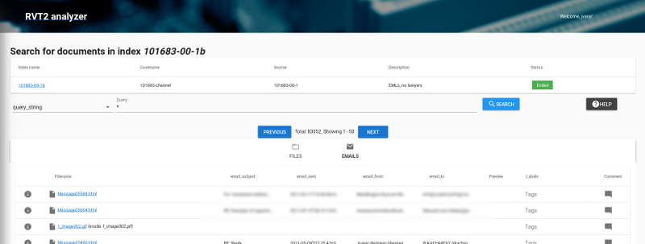
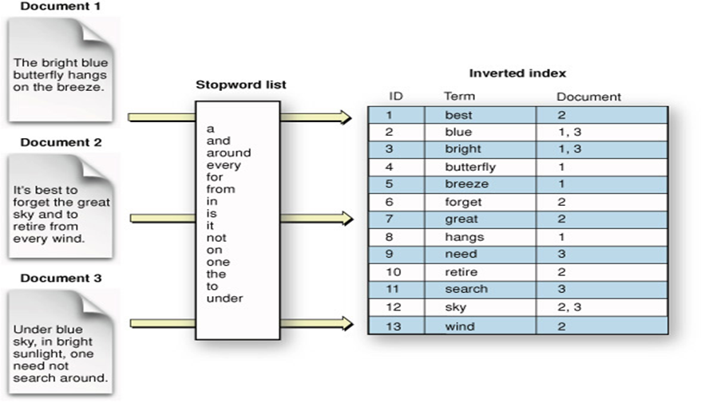

# User manual

*RVT2's analyzer* provides a web interface to perform forensic analysis on sources previously indexed in an ElasticSearch server. Using *RVT2's analyzer*, an analyst can run complex queries on document content and metadata, and tag or comment documents.

The analyzer is compatible with all modern browsers: Google Chrome, Mozilla Firefox, Microsoft Edge and Safari 10+.
It is not compatible with Internet Explorer or Safari 9 and older.

Table of contents:

[[toc]]

## What does and what doesn't an indexer do?

:::warning
This section introduces indexers and ElasticSearch. Many analysts are used to `grep` to look for keywords within documents. Indexers work in a very different way. You must read this section very carefully and navigate the provided links to prevent false negatives.
:::

RVT2 analyzer searches for content indexed in ElasticSearch, which uses **search engine indexing**. You can find a good introduction to the topic at <https://en.wikipedia.org/wiki/Search_engine_indexing>.

The RVT2 indexer plugin parses documents in a source, extracts the content and metadata in these documents, and indexes the output into ElasticSearch. Many different options can be configured, for example, to specify the exact metadata to index or the content language. The default options must be enough for most cases.

### Content

The content of a document is parsed using Tika, analyzed using [Elastic's standard analyzer](https://www.elastic.co/guide/en/elasticsearch/reference/current/analysis-standard-analyzer.html) and indexed as text. This means:

- You can only search for files [supported by Tika](https://tika.apache.org/1.19/formats.html).
- Content will be converted to lowercase text and tokenized using some punctuation signs as separators.
- Punctuation signs are not indexed.
- Language analyzers are optional and they are not used in the default RVT2 configuration. As a consequence, using the default configuration:
    - *Stopwords* (common words in a language) are also indexed.
    - Verbs and nouns are not normalized: singular terms **won't** match plural terms.
    - In some query types, you can try adding `*` to the end of the term.
- The RVT2 indexer supports several query types as defined by ElasticSearch. Currently: `match`, `simple_query` and `query_string`. See below.

:::warning
Documents and queries are parsed to text, tokenized, indexed and (depending on the query type) fuzzy searched. All in all, you are not running a `grep` on actual documents or their content! ElasticSearch will take a best effort approach while running queries, but there is not a guarantee that you'll get all documents matching a query.

If you really need a `grep`, use other RVT2 plugins such as `search`.
:::

These are some examples for text fields:

- The content `The 2 QUICK Brown-Foxes jumped over the lazy dog's bone.` will be tokenized and indexed as `[ the, 2, quick, brown, foxes, jumped, over, the, lazy, dog's, bone ]`
    - Notice these queries **won't** match this content because the query terms are not present in the tokenized content: `fox`, `dog`. However, `fox*` and `dog*` **might** match the content.
- The content `johny@someserver.com` is tokenized and indexed as `[johny, someserver.com]`.
    - These queries will match:
        - *match* query type: `johny@someserver.com`, `johny someserver.com`, `someserver.com`, `"someserver.com johny"` (*match* type interpretes sentences as simple OR terms)
        - *query_string* query type: `johny@someserver.com`, `johny someserver.com`, `someserver.com`, `someserver*`, `someserver?com`, `someserver.com johny`, `johny@sameserver.com` (notice the `a`)
    - These queries **won't** match because the query terms are not present in the tokenized document:
        - *match* type: `someserver`, `johny@someserver` (`someserver.com` is indexed, `someserver` is not), `someserver*` (*match* type does not support wildcards)
        - *query_string* query type: `someserver`, `johny@someserver*`, `"someserver.com johny"` (this is a sentence in the wrong order)
- `http://world.com/hello` is tokenized and indexed as `[http, world.com, hello]`.

### Metadata

Documents are parsed using Tika, and their metadata fields are mapped according to the map
in the `tika-mapping.cfg` configuration file. These fields are parsed using both Elastic's standard
analyzer and [keyword analyzer](https://www.elastic.co/guide/en/elasticsearch/reference/current/analysis-keyword-analyzer.html),
and most od them are indexed both as an analyzed text (field *content_type*, for example)
and raw keyword text (field *content_type.keyword*, for example).

The specific fields can be configured specifically for each case.
Nevertheless, we try using these fields in all cases:

- *embedded_path*: If a document is inside another, this is the path of the document inside the root document. Roots documents do not have an *embedded_path*. For example:
  - If the document is an image inside a zip, the *embedded_path* is the path of the image according to the zip file.
  - If the document is an attachment to an email, the *embedded_path* is the name of the attachment.
- *path*: The path the to root document, relative to the case directory. This is the path of the zip file or the email file in the examples above.
- *filename*: The filename of the root document.
- *extension*: The extension of the root document. Keep in mind a user can change the extension of any file.
- *content_type*: The content type of the document, according to the parser Tika.
- *content*: The content of the document, if any,
- *author*: The author of the document according to the metadata, if any.
- *last_modified*: When the document was modified according to its metadata (not the filesystem), if any.
- *comment*: A comment from an analyst.
- *tags*: A list of tags for this document.
- *analyst*: The name of the analyst that commented or tagged a document.
- *blindsearches*: If present, the document is a result of these searches.

## Logging into the system

When an analyst first enters the system, an analyst enters his/her name and the
URL to the ElasticSearch server that indexes the documents.

- The analyst name is used to mark the last analyst that commented or tagged a document.
This way, if a different analyst explores the same case and does not understand why a document is tagged
as *important*, the original analyst can be contacted.
- There may be different ElastiSearch servers for different cases in the network.

After entering a name and an ElasticSearch URL, a list of indices stored in the
server is provided. Select the index you are interested in and start your analysis.

## Tags and comments

Analysts can use arbitrary text to tag documents. Some tags are classified by color to assist during visual inspections:

- Red color: `important` and `relevant`. Use these tags for documents of importance to the objectives of the investigation process.
- Yellow color: `warning` and `check`. Use thses tags to indicate another analyst to check your findings.
- Green color: `seen` and `irrelevant`. Use these tags to mark a document as not important or already seen.

::: tip
Tagging a document as `important` and `seen`, for example, might make sense.
:::

::: warning
Tags should have only lower case letters. Do not use special characters or spaces.
:::

Comments are plain text and they don't have any special syntax, but the use of *Markdown* is encouraged.

::: tip
The name of the last analyst that edited tags or comments is stored in the *analyst* field.
:::

## Query Types

Currently, the *RVT2's analyzer* provides templates for three different query types: query string, simple query and matches.
This types of query are described in depth in the ElasticSearch documentation. Next, we provide some examples of its usage.

### Query String

Query string queries use [Lucene's syntax](https://lucene.apache.org/core/2_9_4/queryparsersyntax.html). By default, all fields are searched.

- `*` returns all documents. Useful to know the size of the index.
- `dog cat` is equivalent to `dog OR cat`. This query searches for documents including either *dog* or *cat* (both terms).
- `dog cat^2` searches for documents including any of these terms, but considers *cat* twice more relevant when sorting results.
- `dog AND cat` searches for documents including both *dog* and *cat*.
- `dog NOT cat` searches for documents including *dog* but not *cat*.
- `(dog OR cat) AND mouse` is an example of a complex query.
- `ni?o` matches *niño* as well as nino.
- `nina~` matches words similar to *nina*, such as *niña* or *mina*.
- `"computer virus"~5` searches for *computer* and *virus* separated by, at most, 5 other words.
- `extension:.pdf AND path:*dog*` search for documents with extension *.pdf* and the word *dog* in its path (either folder or filename).
- `last_modified:[2016-01-01 TO 2017-12-31]` searches for documents modified between January, 1st 2016 and December, 31st 2017.
- `tags:important` searches for documents tagged as *important*

### Simple queries

Simple queries use [a simplified syntax](https://www.elastic.co/guide/en/elasticsearch/reference/current/query-dsl-simple-query-string-query.html).
By default, all fields are searched.

- `*` returns all documents. Useful to know the size of the index.
- `dog cat` is equivalent to `dog | cat`. This query searches for documents including either *dog* or *cat* (both terms).
- `dog | cat^2` searches for documents including any of these terms, but considers *cat* twice more relevant when sorting results.
- `dog + cat` searches for documents including both *dog* and *cat*.
- `dog + -cat` searches for documents including *dog* but not *cat*.
- `(dog | cat) + mouse` is an example of a complex query.
- `ni?o` matches *niño* as well as nino.
- `nina~` matches words similar to *nina*, such as *niña* or *mina*.
- `"computer virus"~5` searches for *computer* and *virus* separated by, at most, 5 other words.

### Matches

Matches are simple queries that search only in the *content* field. The text is searched *AS IT IS*, without any special syntax.

Check [the match query](https://www.elastic.co/guide/en/elasticsearch/reference/current/query-dsl-match-query.html) in the ElasticSearch documentation.

### Administration

Admins can edit or delete the job information. To enter the admin console, add `admin` to the URL.
