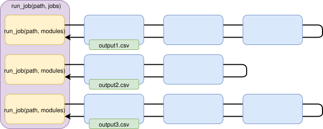

# Basic concepts

The RVT2 is a conversor between formats. The conversion is done by different *modules* chained together in a *job*. In addition, a configuration object glues the modules together defining options (input and output files, formatting, URLs...) and declares jobs. There are a number of default jobs already declared ready to be used and you can declare your own jobs with your own modules and your own configuration. The core modules of the RVT2 provide basic modules and the configuration system, while modules specific to specific tasks (extraction of forensic artifacts from iOS or Windows, sending
information to an ElacticSearch server...) are provided by additional *plugins* that must be loaded specifically.

## Modules and jobs

The RVT2 uses jobs and modules. Both are configured using a number paramters that are set in configuration files or the command line.

- A **module** is a class that extends `base.job.BaseModule`. A module does something very specific, such as reading a CSV, writing a JSON file or parsing an EVTX file suing an external tool. A module takes a `path` as an input, reads its configuration and yields a dictionary. That is to say: a module returns a generator of dictionaries. A module can be connected to another module (called `from_module`), to send the path and receive additional data.


- A **single job** is a chain of modules connected one after the other to perform a complex task. For example, read the contents of a CSV file, filter out the lines not containing a regex, save the results to a JSON file, convert the JSON file to be ready to be sent to ElasticSearch... A chain can have any number of modules, or even just one since a module can run as a single job. The modules in a single job are chained together, and share information to each other.


- A **composite job** is a chain of single or composite jobs that are run sequentially one after the other. Jobs in a composite job run one after the other in a single-thread. By default, jobs in a composite job will run even if the previous jobs failed. Jobs in a composite job are not chained together: if the second job needs some information from the first job, the first one must save the information in a file that will be read by the second job.



## A job as a chain of modules

Modules are chained together in jobs: the first module get a `path` as a parameter and calls to the `run` method of the second module (the `from_module`, from the point of view of the caller), which calls to the `run` method of the third module and so on. A module returns a generator of dictionaries with the relevant information to the previous module.

- **Input modules**: read CSV of JSON files from `path`, or run a command and get the output... For example, a module reading a CSV file such as `base.input.CSVReader` will read a CSV file, manages the first line of the file as the headers, and return a generator of dictionaries with each line in the CSV file.
- **Intermediate modules**: they (optionally) do something on the path before calling to `from_module.run(path)` and get data from `from_module.run(path)`, optionally modifying this information.
- **Output modules**: they output the information they get from `from_module` and save it in a CSV or JSON file, or print it on the standard output.

A module gets a path as an input parameter, it can do something before calling to the next module in the chainor just wait for the answer and do something on the answer. These are some examples of modules:

1. `base.output.JSONSink` sends the path it receives to the next module without any change, waits for the answer and save the data in an `outfile`.
1. `indexer.elastic.ElasticSearchAdapter` sends the path it receives to the next module without any change, waits for the answer, add some fields to the data to allow it to be sent to an ElasticSearch server, and returns the data to the previous module.
1. `base.directory.DirectoryFilter` walks the files and subdirectories in the path, and calls to the next module for each one of the file it finds.
1. `indexer.tikarpaser.TikaParser` parses the file in the `path` using Apache Tika, and returns a dictionary with 

This modules can be combined in a job like this (the job described next is roughly similar to the default job `indexer.directory`) For more information about the configuration files, read [Configuration and running](/rvt2/configure.md):

```ini
[JOBNAME]
description: Parse the contents of a source
path: ${sourcedir}/mnt/p01
modules:
    base.output.JSONSink outfile='home_user.json'
    indexer.elastic.ElasticSearchAdapter
    indexer.directory.DirectoryFilter
    indexer.tikarpaser.TikaParser
path: /home/user
```

You can run this job as `rvt2 -j JOBNAME` and then:

1. `base.output.JSONSink` sends the path `/home/user` to `ElasticSearchAdapter` and waits for the answer.
2. `indexer.elastic.ElasticSearchAdapter` sends the path `/home/user` to `DirectoryFilter`
3. `base.directory.DirectoryFilter` walks the subdirectories in `/home/user`, and feeds all files in this directory and subdirectories one by one to `TikaParser`
4. `indexer.tikaparser.TikaParser` parses files, and returns the result as an array of dictionaries to `DirectoryFilter`.
5. `base.directory.DirectoryFilter` does not modify the output from the parser and yields the result to `ElasticSearchAdapter`
6. `indexer.elastic.ElasticSearchAdapter` adapts the dictionaries to be suitable for bulk injection into an ElasticSearch server.
7. `base.output.JSONSink` saves the output in a file `home_user.json`.

The process ends here: you can send this file to an ElasticSearch server using you own tools, or use other modules in the RVT to read this fiel and send it to ElasticSearch.
