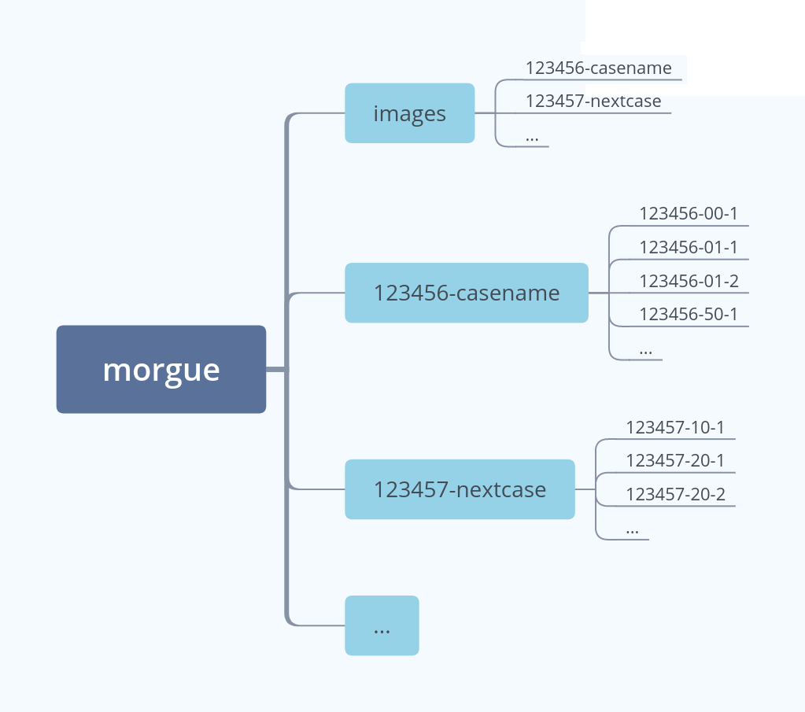
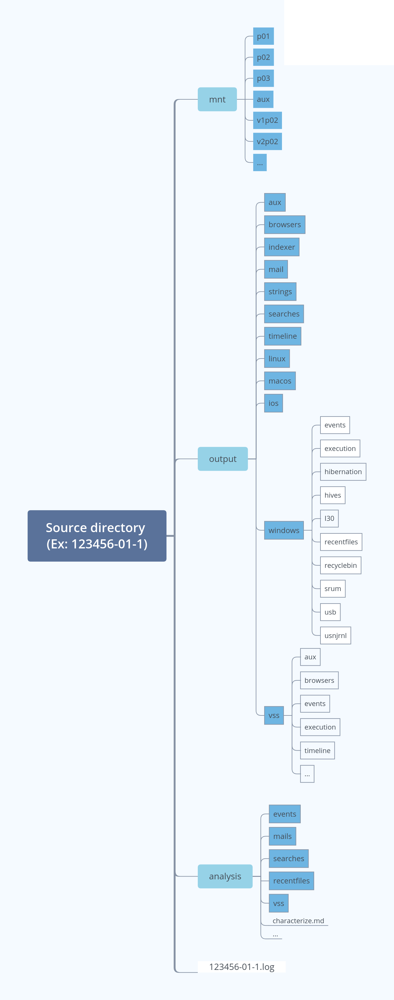

# Folder structure

The Revealer Toolkit2 defines its own structure to organize the forensic cases. The main folder is refered as the *morgue*, and stores all the disk images and results of forensic analysis. 

RVT2 can handle more that one morgue. By default, one morgue is defined at the location ``/morgue``. 

The morgue location, as well as its subfolders, can be custom defined within configuration files. However, some RVT modules rely on a predefined structure
that allows to correlate differents forensics artifacts easily. It is advisable not to modify the structure beyond the morgue location itself and the *images* location. 

## Cases

Each forensic case is by default determined by a *case number* and a *case codename*, separated by a dash. For example, *100101-ghost*.

Each case has a folder assigned in the morgue, where all the forensic data is stored for each source.

## Sources

Under the Revealer Toolkit2, information sources are organized with:

- Devices: each case has a number of devices: computers, cell phones, digital cameras, ... They are numbered sequencially from 01 to 99.
 A device is named as *casenumber-devicenumber*, for example, 100101-01 for the case 100101 and device 01.
- Disks: each device has a number of disks: hard disks, CD’s, memory cards, ... They are numbered sequencially from 1 to 9.
 A disk is named as *case-device-disknumber*, for example, 100101-01-1, for the disk 1

## Images

The disk images are stored, in raw format, in a designed folder for every case inside the directory *images*.

## Source directory structure

The Revealer Toolkit2 manages and executes modules, which performs forensic operations on the disk images and disk information. All these forensic results are stored in the source directory the image is associated to. Each source generates three main folders: *mnt*, *output* and *analysis*.

## mnt

Location where disk partitions are mounted. Contents of each partition are stored in subfolders like ``p03``, following the numeration used by the Sleuthkit command *mmls*.

Partitions with Windows filesystems may contain VShadow Snapshots. These are mounted with names such as ``v2p03``, which in this case indicates the second vshadow snapshot of partition 3.

Some partitions requiere auxiliary mounting points (using mounted *fusedevices* with ``bindfs``, ``vshadowmount`` or ``dislocker``), and are stored inside *aux* subfolder. The contents still can be found in the subfolder corresponding to the partition name.

## output

Main folder with the results of automated extraction of various artifacts.

### output/timeline

Timeline for the all files found in every partitions of a disk (VShadow Snapshots excluded). The documents show paths, timestamps and other metadata associated to every file found in the filesystem.

### /output/browsers

Information about history, downloads, cookies, ... for all browsers found in every partition.

### output/indexer

Documents indexed in order to be used by searching services, such as Elastic.

### output/mail

Parsed data of mails found in disk, either individual or contained in bigger mail structures such as *pst*.

### output/string

Relation of all printable character sequences found in disk, also in the slack space.

### output/searches

Results of keyword searches against strings

### output/ios

Documents specifically related to IOS systems.

### output/linux

Documents specifically related to Linux systems.

### output/macos

Documents specifically related to MacOS systems.

### output/windows

Documents specifically related to Windows systems.

#### output/windows/events

Information extracted from Windows event logs

#### output/windows/execution

Information extracted from Windows artifacts such as *prefetch*, *bam* or *rfc*, associated with program and services executions.

#### output/windows/hives

Information extracted from registry hives. Output files are organized depending on the type of information or hive parsed.

#### output/windows/hibernation

Information obtained from *hiberfil.sys*.

#### output/windows/i30

Parsing of I30 Index attributes, both in allocated and slack space.

#### output/windows/recentfiles/

Information related to *jumplists* and *lnk* files found in disk.

#### output/windows/recyclebin

Information about files found in RecycleBin.

#### output/windows/srum

Information from the System Resource Usage Monitor (SRUM)

#### output/windows/usb

Specific usb artifacts information, like *usb_setupapi*. More information on usb devices can be found in the registry and is stored under *output/windows/hives*.

#### output/windows/usnjrnl

Folder with NTFS Journal dump, and a filter with ended journal processes.

### output/vss

All the information extracted from VShadow Snapshots. Follows a substructure based on *output* and *windows* folders. These subfolders contain the same information previously described, but applied only to VShadow Snapshots found.

## analysis

Contain general reports and other documents with selected information about different artifacts. This is a start point for analysis, since the reports are more descriptive than the raw information they are based on, found in *output* directory. 

### analysis/events

Series of filtered information reports for some event logs.

### analysis/mails

Relation of metadata information about all mails found in disk.

### analysis/recentfiles

Documents containing selected data from *jumplists* and *lnk* files.

### analysis/searches

Location of *pdf* files describing the full results of searches against strings.

## Log file

RVT2 stores by default the logs of all executed jobs in a directory
`${sourcedir}/log`. The filename is the job identifier.

In addition, a list of the already executed jobs and their status can be found
at `${casedir}/rvt2.jobs.json`. You can also access to this information using
the job `status`.
